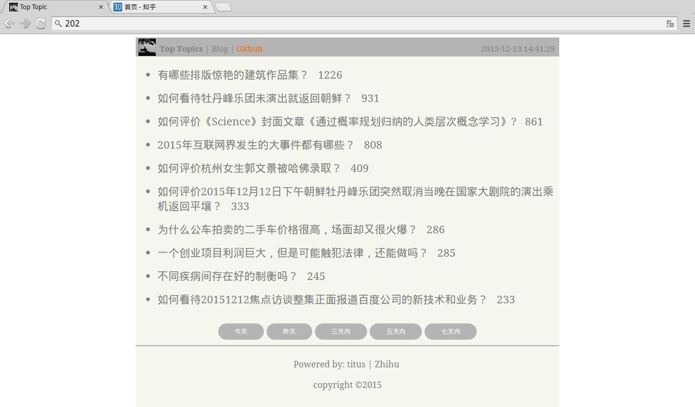

## top-topic-Zhihu
抓取「知乎」网站每天**新**提出的热门 top10 问题聚合显示，提供另一种看知乎的姿势。包含前后端整个项目。

世界很大，不被纷繁的 timeline 所迷惑。

## 步骤
需要这几步来完成目标：

```
抓取 ——> 存储(数据持久化) ——> 分析 ——> 展示
```

**抓取**：抓取部分主要是爬虫，先手动输入验证码获取登录 Cookie。然后带着该 Cookie 模拟发出 Get 请求来获得网页数据。思路是从自己的个人主页开始爬，先爬出现在主页 timeline 上的所有人，再爬这些人主页上的其他人...，直到数据量足够大。把人的 ID 存储在 people 中。接着继续爬 people 中所有人主页上提出的问题，并获得问题的关注人数和提问时间。把抓取到的问题存储在 question 中。

**存储**：存储可以把上面的 people，question 写入文本或者 MySQL 数据库,。中间数据也应该放到数据库中，不然内存会被无穷多的递归生成的中间数据填满。本项目使用带主键的 MySQL 表模拟内存 set 来存储 people。

**分析**：网站目的是获取每天或者一个时间段内新提出的 top10 热门问题，所以需要对时间过滤，对关注人数排序。这都可以在 SQL 查询中完成。

**展示**：展示包括后台和前端两部分，后台需要在 DB 中取得数据构造成 JSON 格式以 CGI 的形式提供给前端调用。这里使用 Python Flask 框架提供 CGI 后台服务。前端页面主要是跨域 AJax 请求后台 CGI 来获得数据，结合定义的模板来展示页面。在版本 V1 中使用 AngularJS 来简单的编写模板及 AJax 请求的逻辑部分，在版本 V2 中使用 artTemplate 和封装原生的 Js 来满足需求。

## 目录结构

```
└── top-topic-Zhihu
    ├── assets
    │   └── demo.png
    ├── captcha.gif    # 拉取到本地的验证码
    ├── dataSpider.py  # 爬虫
    ├── dataAccess.py  # AO 服务
    ├── dataCGI.py     # Python Flask 提供给前端的 CGI
    ├── people_db.txt  # 抓到的人
    ├── people_visited_db.txt
    ├── question_db.txt# 抓到的问题
    ├── README.md
    ├── tool           # 工具
    │   └── cron.sh    # 定时任务 每天 23:00 执行 dataSpider.py
    └── www            # 网站文件
        ├── assets    
        │   ├── tuzhii.ico
        │   └── tuzhii.jpg
        ├── css
        │   ├── button.css   # 按钮样式
        │   └── toptopic.css # 网页样式
        ├── index.html
        └── js
            └── template.js  # artTemplate 库
```

## 依赖

+ BeautifulSoup
+ requests
+ MySQLdb
+ flask
+ flask.ext.cors

## 使用方法
+ 本地 MySQL 中建数据库 `top_topic_zhihu`。dataAccess 文件中 __init__ 方法 MySQL 的密码更改为自己的密码

+ dataSpider.py 中 get_login_cookies 函数中 email 和 password 修改为自己的账户密码，__main__ 中

`text = crawl_url(req, local_cookies, 'https://www.zhihu.com/people/your_id')`
 
your_id 修改为自己的用户 ID

+ index.html 中请求的服务器地址 your_ip 修改为自己机器的 IP。dataCGI.py 中 __main__ 中的 your_ip 也修改为此 IP。

```
var resource_url = "http://your_ip:5000/toptopic/api/topics/"
```

+ 执行 dataAccess.py 下列方法建表

```
    info.create_question_table()
    info.create_people_table()
    info.create_people_merged_table()
```

+ 执行 dataSpider.py 下列方法抓取 people 数据，需要手动输入本目录下图片中的验证码。

```
    req, local_cookies = get_login_cookies()
    # 第一次获取自己主页的网页
    text = crawl_url(req, local_cookies, 'https://www.zhihu.com/people/your_name')

    # 构造 people 的数据库
    construct_people_db_v2(req, local_cookies, text)
```

+ 执行 dataAccess.py 下列方法合并 people 表

```
    info.merge_people_of_db()
```

+ 执行 dataSpider.py 下列方法抓取 question 数据

```
    convert_from_people_to_question(req, local_cookies)
```

+ 运行 dataCGI.py 文件，在浏览器输入 `http://127.0.0.1/` 即可访问网站

## 配置 Nginx

网站写好后需要服务器来提供访问，由于是前后端分离的 SPA(Single Page Application)，所以使用 Nginx 提供静态页面的 HTTP 服务。作下面的配置：

+ 在 Nginx 安装目录 `/usr/local/nginx/html` 下新建一个到网站源码的软链接：

`ln -s /your-src/www ./www`

把所有的源码放在 `/your-src/www` 目录。这样便于版本管理。当源码发生更改，只需要更改软链接。

+ 修改 Nginx 配置文件
```
http {
    server {
        listen       80;
        server_name  localhost;

        location / {
            root   html/www;
            index  index.html index.htm;
        }
    }
}
```
root 修改为 html/www，因为上一步是把源码放在了文件夹 www 下。

+ 更改文件和目录权限，以免出现 403 Forbidden 错误。

`find ./ -type d | xargs chmod 755`

+ 重启 Nginx 服务

```
cd /usr/local/nginx/sbin
./nginx -c nginx.conf
```

## Demo


